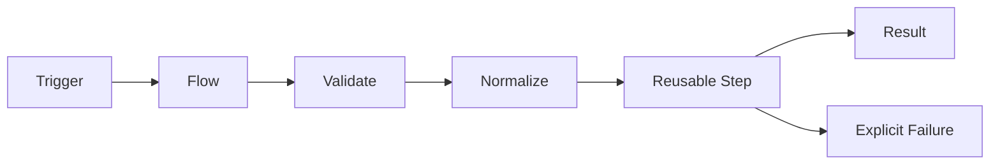

# Contributor Architecture Proposal

> The current implementation is a showcase. Treat it as executable notes, not as the final architecture.

This document explains the intended Nano Railix architecture in plain language.
It is written for contributors who need to understand what Railix is supposed to become before changing code.

## One-Sentence Model

Nano Railix is a Java ROP library for building applications as readable data flows:

```text
trigger -> flow -> step -> step -> step -> result
```



The goal is to model user and data flows directly.
Each flow has a clear start, a clear end, named steps, explicit errors, and simple data moving between steps.
That makes the system easier for humans to understand and easier for machines, including AI tools, to inspect,
generate, audit, and refactor.

## Why Railix Exists

Most MVC microservice architectures split a product into many small services too early.
That creates operational and design friction:

- cross-service communication
- distributed tracing overhead
- duplicated auth, routing, and rate-limit logic
- network failure between local business steps
- scattered deployment units
- unclear ownership of one user journey

Nano Railix aims to go back to a boring monolith, but not to a ball of mud.
The monolith contains many explicit flows.
Each flow is small enough to understand and structured enough to inspect.

In short:

- use one executable where possible
- keep user/data flows explicit
- scale individual steps when needed
- connect Railix instances only when one process is not enough
- avoid microservice communication until it is actually useful

## Current Code Status

The code in `src/main/java` is useful as a showcase for the desired API direction.
It is not the production architecture.

Contributors should assume:

- public names and examples may survive
- internal structure may be replaced
- tests describe useful behavior, but not necessarily final internals
- no current class is sacred
- ADRs win when code and documents disagree

This matters because the real work is to turn the showcase into a boring, reusable flow platform.
Do not preserve accidental implementation details just because they exist today.

## Core Idea: ROP Flows

Railix follows Railway Oriented Programming.
A flow is a chain of steps.
Each step receives data, returns success or explicit failure, and decides whether the flow continues.

```text
incoming JSON
  -> validate
  -> normalize
  -> set defaults
  -> translate
  -> enrich
  -> persist
  -> respond JSON
```

The flow should be readable top to bottom.
The shape should stay close to the real user journey or data journey.

Good flow design:

- starts with validation, normalization, and defaults
- makes expected data types and fields known early
- keeps errors explicit at the step boundary
- avoids random exception throwing as control flow
- composes reusable steps where that improves readability
- keeps data movement simple enough to diagram

## Data Model

Railix is data-flow first.
Most inputs are JSON, most outputs are JSON, and many NoSQL stores are JSON-like as well.
Railix should make that path simple instead of forcing a domain-object ceremony for every flow.

The transport layer between steps uses only JSON-native values:

- string
- number
- boolean
- list
- map
- absent value

This does not mean nested JSON is forbidden.
Nested data must be supported.
It means step contracts should use simple data shapes that can be represented as JSON without custom object graphs.

`TypeMap` remains the core carrier for payload, ctx, and config.
Railix should reuse TypeMap path and conversion semantics instead of inventing its own dotted-path language.

Rules:

- payload is runtime input data
- ctx is per-execution derived/transient data
- global config is runtime/app configuration
- rail metadata describes the rail itself
- keys are sanitized through `Names.sanitize()`
- public path APIs stay `Object...`
- public APIs do not return `null`

## Shape Definitions

Flat JSON is easy.
Nested JSON still has to be first-class.

Railix needs a way for early flow steps to define what later steps can rely on:

- path
- expected type
- required or optional
- default value
- normalization rule
- validation rule
- translation or mapping rule

Example intent:

```text
payload.user.email
  type: string
  required: true
  normalize: trim + lowercase
  validate: email

payload.user.age
  type: number
  required: false
  default: 0
```

The exact API is not decided.
The architectural requirement is clear: once the start of a flow validates, normalizes, translates, and defaults
fields, later steps should be able to rely on that shape without defensive chaos.

## Steps

A step is the main unit of work.
It can be a function, a reusable named step, or eventually a marketplace step.

Responsibilities:

- accept JSON-native payload/ctx data
- perform one understandable operation
- return an explicit success or explicit failure
- expose enough metadata to be diagrammed and audited
- avoid hidden shared state
- avoid throwing exceptions for expected business failures

Future reusable steps may include:

- OAuth flow parts
- IP filters
- deny lists and allow lists
- routing
- rate limits
- validation packs
- normalization packs
- persistence adapters
- audit logging
- outbound HTTP calls

Reusable steps should be small, boring, and inspectable.
Marketplace steps must not become magic jars of fog. That is how systems become haunted.

## Errors

Errors should be explicit where they arrive.

Expected failures should be modeled as results, not as random thrown exceptions.
Examples:

- missing field
- invalid token
- blocked IP
- rate limit exceeded
- validation failed
- downstream timeout
- persistence conflict

Unexpected exceptions still exist in Java.
Railix should catch them at the execution boundary, convert them into explicit failures, record telemetry, and let the
flow decide whether a recovery path exists.

The default contributor bias should be:

```text
return a clear failure -> route or stop the flow -> record telemetry
```

not:

```text
throw somewhere -> hope another layer understands it
```

## Triggers Define Runtime Mode

Railix should not force users to choose between "CLI app" and "server app" through a separate application taxonomy.
The flow triggers define how the application runs.

Examples:

- HTTP trigger: starts an HTTP server and keeps the app running
- file watcher trigger: starts a watcher and keeps the app running
- scheduler trigger: starts background scheduling and keeps the app running
- args trigger: runs once and exits
- manual trigger: useful for tests, embedded use, and custom runtimes

This keeps the model simple:

```text
background trigger exists -> app stays alive
single-run trigger only -> app exits after flow completion
```

Railix only needs to know which background functions to start and stop, and in which order.

## Graceful Shutdown

Flows have a start and an end.
That makes graceful shutdown straightforward.

Shutdown phases:

1. stop accepting new triggers
2. let already-started flows continue
3. drain queues where configured
4. stop background actors/resources in order
5. exit with an explicit outcome

This is another reason to keep flows explicit.
If a system knows where work enters and where it ends, shutdown is a protocol instead of a prayer.

## Monolith With Scalable Steps

Railix is monolith-first, but it should not be single-thread-only or single-node-only.

Scaling levels:

- within one step using virtual threads where useful
- per step through local queues
- per step by scaling worker count up or down
- across two or more Nano Railix instances when they share the same step definitions

The long-term direction is that compatible Railix instances can share load for matching steps.
The cluster communication can be similar in spirit to Hazelcast:

- discover peer instances
- know which steps each instance can execute
- share or route queued step work
- keep ownership and failure handling explicit
- avoid forcing users to split the app into microservices

This is future architecture, not current implementation.
The important decision is that scaling belongs around steps and flows, not around premature service boundaries.

## Diagrams And Audits

Because Railix flows are explicit, Railix should be able to output diagrams.

Diagram output is useful for:

- architecture reviews
- security audits
- compliance audits
- onboarding
- AI-assisted analysis
- visual UI builders
- detecting dead or unreachable flow paths

At minimum, a diagram should show:

- triggers
- flow names
- step names
- branches
- queues
- external systems
- terminal success and failure outcomes

Mermaid export is the first likely target because it is text-based and easy to review in git.

## UI And No-Code Direction

Long term, Railix can become a platform for building applications from flows.

The code-first model should remain clean enough that a UI can later represent it:

```text
pick trigger -> chain steps -> configure paths/types -> define errors -> publish flow
```

That does not mean the core becomes visual-builder-driven.
It means contributors should avoid designs that only work when hand-coded Java hides important structure.

If a flow cannot be reasonably diagrammed, audited, or represented as structured metadata, the design is probably too
opaque for Railix.

## Public DSL

The public DSL is the user-facing contract.
It should be readable top to bottom and should avoid exposing internal execution details.

Responsibilities:

- declare triggered flows
- declare manual/custom flows with `Rail.of().fire(...)`
- compose reusable definitions with `seal()` and `step(otherRailDef)`
- express payload and ctx transformations
- express validation, branching, iteration, parallel work, and terminal outcomes
- expose enough structure for diagrams and audits

Non-responsibilities:

- no public traversal pointers
- no public retry/checkpoint internals in the first pass
- no fake metadata injection for runtime payload
- no mandatory annotations
- no mandatory OOP domain model
- no second public fragment type unless `RailDef` fails a real use case

Annotations may help some developers.
They must stay optional.
The main path is clean flows and reusable steps.

## Rail Definitions

`RailDef` is the immutable form of a rail.
It should be safe to reuse and safe to pass into another rail.

Responsibilities:

- hold the declared step graph or step list
- expose execution entrypoints such as `fire(...)`
- expose read-only definition metadata
- preserve source and runtime configuration references as needed
- expose structure for diagrams and audits

Important rule:

`step(otherRailDef)` means "include this reusable rail definition".
It should not mean "call `.fire()` manually inside a user callback".

## Execution Engine

Execution state is internal.
The engine may change shape freely as long as public behavior stays stable.

Responsibilities:

- create one execution frame per payload
- hold payload, ctx, result state, and failure state
- walk the rail definition in declaration order
- run branches and loops deterministically
- run local queues where configured
- record timing, counters, and failure information
- convert unexpected exceptions into explicit failures at the boundary
- return a `Result`, never a mystery null

Likely internal concepts:

- execution frame
- step cursor
- branch state
- iteration item state
- queue state
- terminal state
- telemetry sink

These names are illustrative.
They are not public API commitments.

## Source Actors

A source actor owns ingress.
It receives external data, converts it into payload and ctx, and asks Railix to execute the rail.

Examples:

- HTTP request receiver
- CLI args receiver
- file watcher
- scheduler
- socket or queue receiver
- user-owned custom adapter

Responsibilities:

- accept or observe external input
- decode input into payload and ctx
- call the rail execution boundary
- stop accepting new work during shutdown
- participate in runtime lifecycle when it owns resources

Source actors are global background services.
They may manage their own pools, sockets, queues, or watchers.
Railix should coordinate lifecycle, not micromanage every resource.

## Runtime Services

`RailixRuntime` is the app-level coordination surface.
It should stay boring and explicit.

Responsibilities:

- hold global config
- hold actor registry
- start actors in deterministic order
- stop actors in deterministic phases
- drain in-flight rail executions
- provide logging and metrics bridges
- expose lifecycle hooks where needed
- coordinate cluster/load-share features when that architecture exists

Non-responsibilities:

- no hidden global mutable singleton as the only way to run
- no mandatory framework container
- no business logic
- no global event bus disguised as lifecycle

## Platform Capabilities

Nano Railix can become a small platform in itself.
The platform features should still be modeled as flows and reusable steps where possible.

Potential built-in or marketplace capabilities:

- OAuth and login flows
- request routing
- IP filtering
- deny lists and allow lists
- rate limits
- request validation
- request normalization
- authorization checks
- audit logging
- metrics endpoints
- health checks
- persistence adapters
- outbound integrations

The rule is simple:

```text
platform capability = trigger + flow + reusable steps + explicit result
```

If a feature cannot fit this model, it needs strong justification.

## Build And Native Executables

Railix should be smaller than Nano and friendly to native compilation.

Target posture:

- minimal dependencies
- no reflection-heavy core
- no mandatory framework container
- Java-first implementation
- GraalVM-compatible direction
- native executable output for fast startup and low operational overhead

The user should mostly care about hardware and configuration.
The application logic should live in flows.

## Future Build And Packaging DSL

The build DSL is future work.
It should let a Railix app describe packaging without forcing users to hand-write every build detail.

Target capabilities:

- generate Maven-compatible project metadata
- detect local JDK/GraalVM toolchains first
- fetch missing toolchains only when needed
- package jar, native executable, Docker image, and app bundles where relevant
- export Mermaid diagrams from named app/rail structure
- support project-local private repositories

This layer must remain separate from the core rail execution model.

## Target Package Shape

Package names should tell contributors where a concept belongs.

```text
org.nanonative.railix
  Rail, RailDef, Result, Outcome

org.nanonative.railix.runtime
  runtime lifecycle, execution boundary, drain/shutdown coordination

org.nanonative.railix.engine
  internal execution frame, step cursor, branch/loop/queue mechanics

org.nanonative.railix.actor
  actor contract, actor registry, lifecycle hooks

org.nanonative.railix.source
  source actor contracts and default ingress adapters

org.nanonative.railix.shape
  data shape, path, validation, normalization, defaults

org.nanonative.railix.config
  config loading, profile cascade, canonical keys

org.nanonative.railix.metrics
  metrics registry and exporters

org.nanonative.railix.log
  logger, log records, external consumer bridge

org.nanonative.railix.name
  key and name normalization

org.nanonative.railix.diagram
  Mermaid and future architecture export

org.nanonative.railix.apt
  optional annotations and annotation processor
```

This is a proposal, not a migration ticket.
Move code only when it improves the architecture, not for folder theater.

## Contribution Rules

Before changing code, answer these questions:

1. Is this public DSL, runtime service, source actor, engine internals, data shape, diagramming, or tooling?
2. Does the change keep the flow readable to a human?
3. Could the flow still be represented in a diagram?
4. Does the change expose internal execution state to users?
5. Does it keep payload, ctx, config, and metadata separate?
6. Does it reuse TypeMap semantics instead of inventing path rules?
7. Does it add a real abstraction or just a new name?
8. Does it keep triggers responsible for ingress?
9. Does it return explicit results instead of null or mystery exceptions?
10. Is the behavior covered from a public entrypoint?

If the answer is unclear, write a small spec note first.
Architecture debt compounds quietly. Very rude behavior.

## Good First Real Milestones

The showcase should become production architecture in this order:

1. Define explicit success/failure result contracts for steps.
2. Define the internal execution frame and separate it from `Rail`.
3. Make `RailDef` a truly immutable reusable definition.
4. Define path/type/default/validation shape metadata for payload and ctx.
5. Define the source actor/trigger contract.
6. Define runtime lifecycle around start, stop accepting, drain, and stop.
7. Move execution metrics into the engine boundary.
8. Add one real trigger, preferably CLI args or JDK HTTP, with public-entrypoint tests.
9. Add Mermaid export for simple linear and branched flows.
10. Keep manual `fire(...)` as a first-class execution path.

Do not start with every actor type.
One honest ingress beats five decorative ones.

## Testing Expectations

Tests should validate behavior from public entrypoints.

Preferred test shapes:

- flow DSL behavior through `Rail` or `RailDef`
- trigger behavior through real input boundaries
- step success and explicit failure paths
- data shape validation/defaulting through real payload maps
- runtime lifecycle through start/drain/stop flows
- config behavior through real files/maps
- logging and metrics through public exported records/output
- diagram export through stable text output

Avoid tests that lock private helper methods into place.
The engine internals need room to become less embarrassing.

## Reading Order

New contributors should read these files in order:

1. `README.md`
2. `spec/CONTRIBUTOR-ARCHITECTURE.md`
3. `spec/ADR.md`
4. `spec/ROADMAP-SPEC.md`
5. `spec/CODE_STYLE.md`
6. `spec/TESTING.md`

When documents disagree, prefer:

1. accepted ADRs
2. this architecture proposal
3. roadmap tickets
4. current code

Current code is last on purpose.
